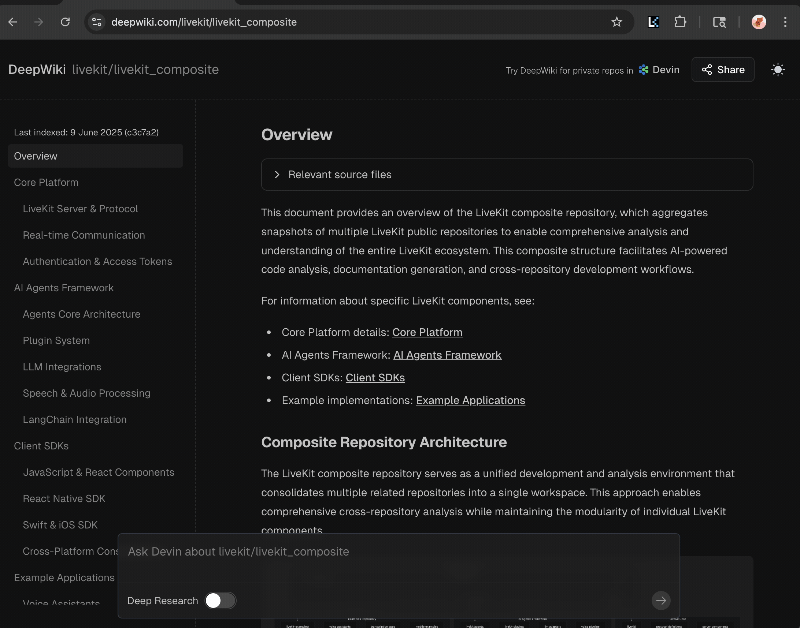

# LiveKit Extension

A Chrome extension to map a composite repo URL to is source repo url.

## How to install:

### Chrome:

1. In Chrome go to `chrome://extensions`
2. Check `Developer mode` if not already active
3. Load this folder using the `Load unpacked` button

## How to use:

While in a `https://github.com/livekit/livekit_composite/...` repository click the `Go To Source` button to go to that file in the source repository.

## How to develop:

