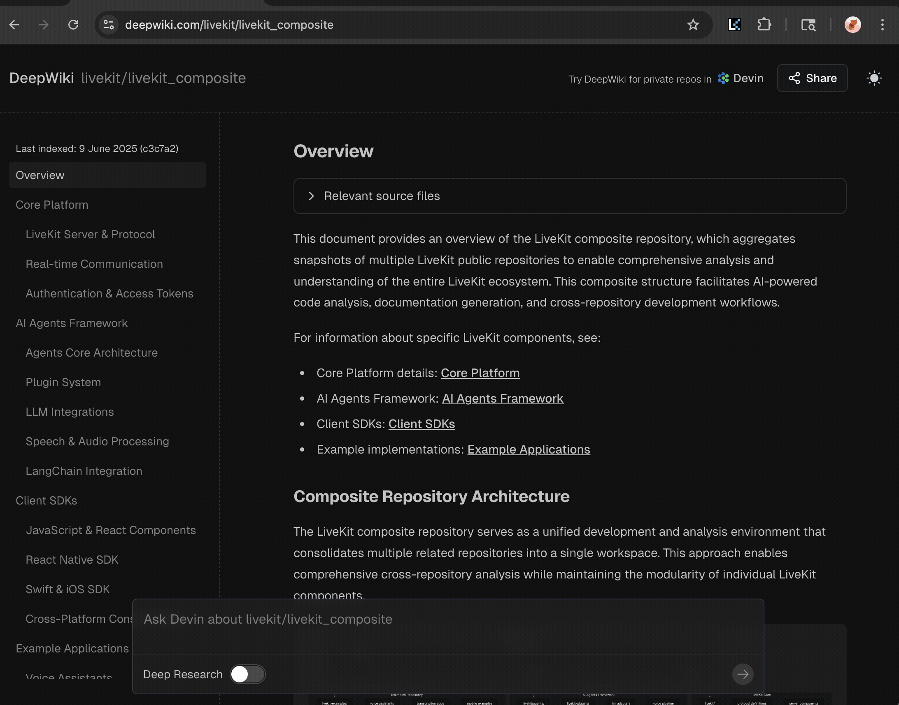

# LiveKit Extension

A Chrome extension to map a composite repo URL to is source repo url.

## How to install:

### Chrome:

1. In Chrome go to `chrome://extensions`
2. Check `Developer mode` if not already active
3. Load this folder using the `Load unpacked` button

## How to use:

While in a `https://github.com/livekit/livekit_composite/...` repository click the `Go To Source` button to go to that file in the source repository.

## How to develop:

1. Make changes to the source files
2. Go to `chrome://extensions` and click the refresh icon on the extension
3. Test your changes

## Future Improvements

- [ ] Add a bundler (esbuild/rollup) to enable shared code between content scripts and background, TypeScript support, and minification

## Security Considerations

- [ ] **Remove empty `content-script.js`** - currently injects into all URLs with `MAIN` world context, which allows page JS access on every site. Should be removed or scoped to specific domains.
- [ ] **Remove unused `debugger` permission** - allows full DevTools Protocol access (pause execution, intercept network, capture screenshots). Not currently used.
- [ ] **Remove or fix `fillField()` function** (main.js) - not currently used, and uses `innerHTML` which could allow XSS. If needed in future, use `textContent` or `createElement` instead.
